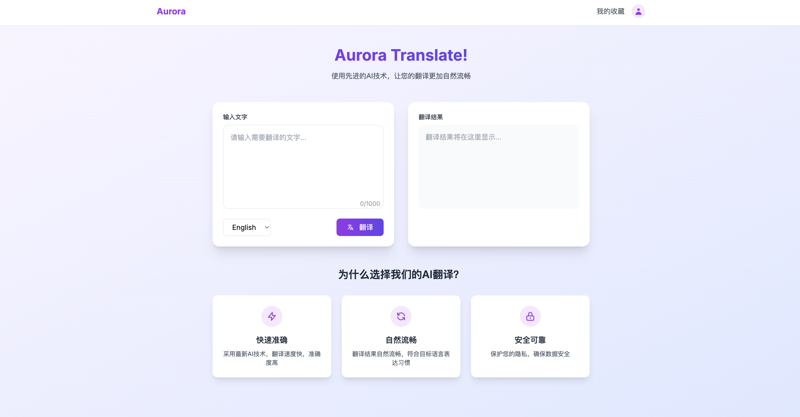
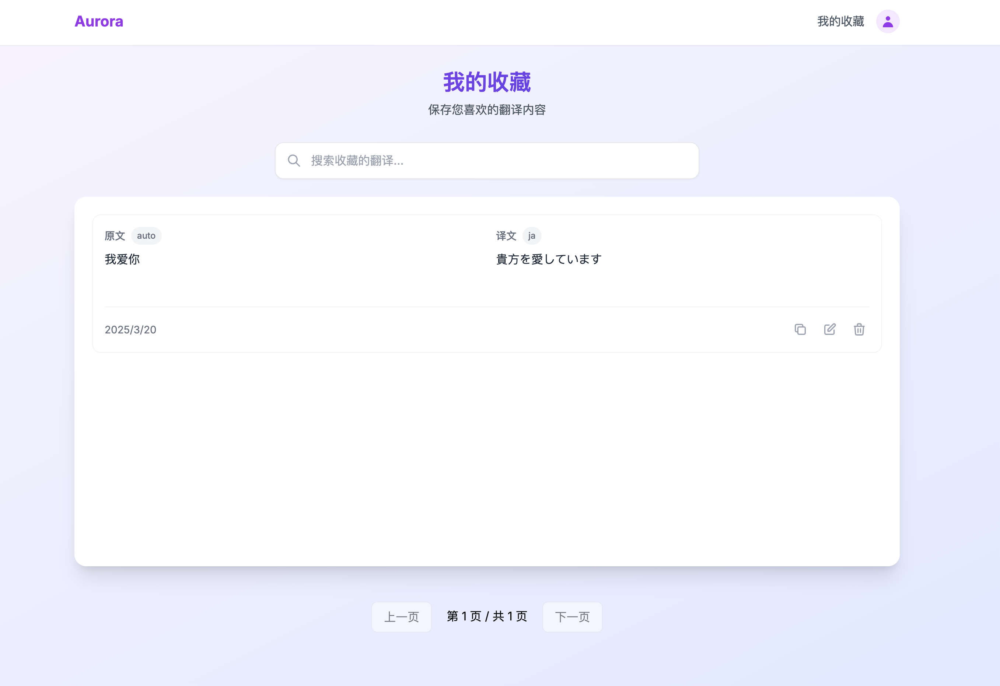

  

   

> 目前处于积极迭代阶段，基本的功能可以使用，欢迎大家提出建议和问题～

# aurora-translate

aurora-translate 是一个好用的翻译工具，支持多种语言的翻译，包括中文、英文、日文、韩文等。前后端分离，为您带来智能的翻译体验以及极致的性能体验。

- 开箱即用，随时随地翻译
- 长句翻译标准，翻译结果更准确
- 支持PC, Phone
- 可以记录您喜欢的翻译句子

另外，如果你想当一个全栈，那么我这个项目可以作为一个全栈项目示例供您学习参考～。

## 技术栈

- 前端：Next.js 14 + Tailwind CSS + TypeScript
- 后端：Go + Gin + Gorm
- 数据库：PostgreSQL
- 部署：Docker

## 贡献

- 如果您有任何问题或建议，请提交 issue 或 pull request。
- 如果您觉得这个项目不错，可以 star 支持一下。
